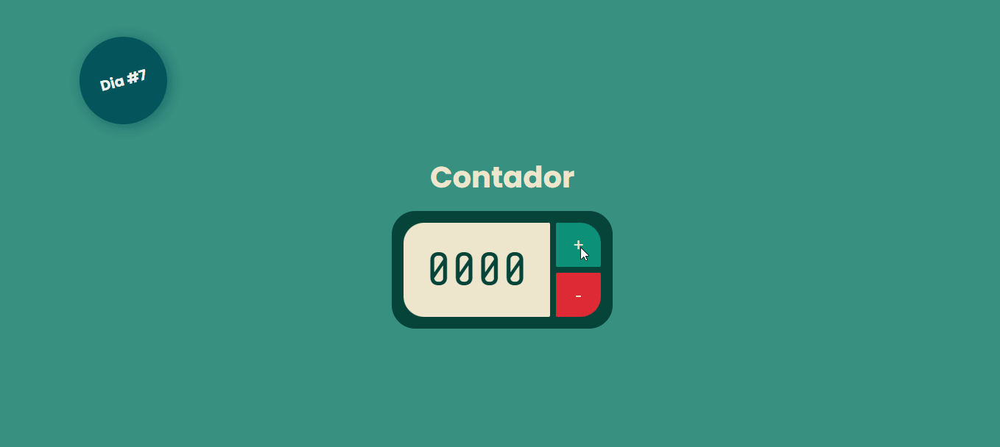
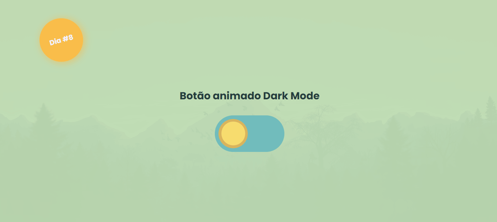

<h1 style="text-align: center; font-weight: bold">#21diasdecodigo 👨🏽‍💻</h1>
O <em>21diasdecódigo</em> é um desafio em que cada dia deverá ser codado um mini projeto diferente, desde um simples hello world até uma landing page completa.

<small style="font-size: 0.7rem; line-height: 50%;">Obs.: O interessante é que todos os dias fosse realizado um desafio, mas por causa de alguns imprevistos isso não foi possível</small>

---

## Dia 1 - Criação do repositório

Nesse primeiro dia deve-se criar um repositório para listar os projetos que serão desenvolvidos durante os 21 dias de código. Esse markdown já faz parte desse primeiro minidesafio.

**Tecnologias:**

- Markdown
- HTML

## Dia 2 - Hello World!

Faça um Hello World customizado com fontes, cores e imagens.

**Tecnologias:**

- HTML
- CSS
- JavaScript

## Dia 3 - Botão Animado

Crie um botão animado.

**Tecnologias:**

- HTML
- CSS
- JavaScript

## Dia 4 - Calculadora

Desenvolva uma calculadora com HTML, CSS e JavaScript.

**Tecnologias:**

- HTML
- CSS (SASS)
- JavaScript

## Dia 5 - 404

Desenvolva uma página customizada que exiba o erro 404.

## Dia 6 - Glassmorphism

Crie um card com o efeito glassmorphism.

**Tecnologias:**

- HTML
- CSS (SASS)

## Dia 7 - Counter

Desenvolva um contador.

**Tecnologias:**

- HTML
- CSS
- JavaScript

## Dia 8 - Toggle Dark Mode

Desenvolva um toggle que altere o tema para claro e escuro.

**Tecnologias:**

- HTML
- CSS
